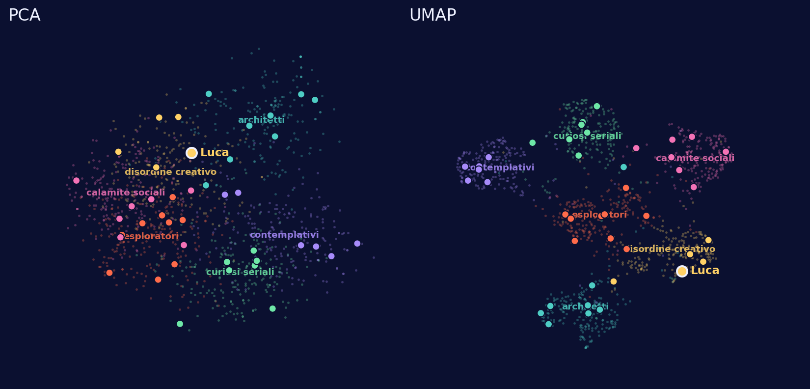

# La mappa delle persone

Installazione interattiva per la Notte dei Ricercatori: le persone rispondono a dieci
domande dal telefono, ogni set di risposte diventa un punto su una mappa proiettata, e la
mappa passa avanti e indietro fra PCA e UMAP per far vedere che sono due modi diversi di
guardare gli stessi dati.



Tre pagine:

| Indirizzo | A cosa serve |
|---|---|
| `/` | lo schermo grande: mappa, QR code, contatore, legenda |
| `/quiz` | quello che si apre inquadrando il QR |
| `/qr` | un QR gigante da stampare per il banchetto |

---

## Come fa a non muoversi la mappa

Il nodo del progetto è questo: se ricalcolassi la PCA a ogni nuovo arrivo, tutti i punti
si sposterebbero e i colori dei cluster ballerebbero. Quindi non si ricalcola niente.

`tools/build_model.py` genera **una volta sola** una popolazione sintetica di 1200
risposte, costruite a partire da sei archetipi. Su quella popolazione calcola:

- la **PCA**: media e loadings, cioè una matrice fissa 8×40;
- l'**UMAP** dei 1200 punti di riferimento;
- i **centroidi** dei sei cluster nello spazio delle componenti principali.

Tutto finisce in `shared/model.js`. A serata iniziata il server non fa nessun fit:

- le 10 risposte diventano un vettore one-hot di 40 numeri;
- lo moltiplica per i loadings già calcolati → coordinate PCA, deterministiche;
- lo assegna al centroide più vicino → colore del cluster, sempre lo stesso;
- per l'UMAP, che non è una trasformazione invertibile, mette il punto nella media pesata
  delle coordinate dei suoi 15 vicini di riferimento.

Conseguenza pratica: **finché non rigeneri `shared/model.js`, la mappa e i sei colori sono
identici dal primo all'ultimo visitatore.** Se un giorno cambi le domande e rilanci lo
script, la mappa cambia — quindi fallo prima dell'evento, non durante.

La nuvola di sfondo che si vede sullo schermo sono proprio i 1200 punti sintetici: servono
a dare forma alla mappa quando ci sono ancora poche persone vere, così alle 21:00 lo schermo
non è vuoto.

---

## Cosa ti serve

- un account GitHub;
- un account Cloudflare (il piano gratuito basta e avanza, vedi *Costi* in fondo);
- Node.js 18+ sul tuo computer, solo per i comandi di setup;
- Python 3 con `numpy` e `umap-learn`, solo se vuoi cambiare le domande.

---

## Passo 1 — Metti il codice su GitHub

Dalla cartella del progetto:

```bash
git init
git add .
git commit -m "Mappa Notte dei Ricercatori"
git branch -M main
git remote add origin https://github.com/TUO-UTENTE/notte-ricercatori-mappa.git
git push -u origin main
```

Il repo può essere privato, Cloudflare ci accede lo stesso.

## Passo 2 — Crea il database

Il database serve solo a tenere l'elenco delle persone della serata.

```bash
npm install
npx wrangler login          # apre il browser per autorizzare
npx wrangler d1 create notte-ricercatori
```

L'ultimo comando stampa un blocco che contiene `database_id = "..."`. **Copia quell'id
dentro `wrangler.toml`**, al posto di `METTI-QUI-IL-TUO-DATABASE-ID`.

Poi crea la tabella, sia in locale che sul database vero:

```bash
npm run db:local
npm run db:remote
```

Ricommitta `wrangler.toml` con l'id dentro:

```bash
git add wrangler.toml && git commit -m "database id" && git push
```

## Passo 3 — Prova tutto in locale

```bash
npm run dev
```

Apri `http://localhost:8788` (lo schermo) e `http://localhost:8788/quiz` in un'altra
finestra. Rispondi al quiz: entro due secondi il punto deve comparire sull'altra pagina.
Se funziona qui, funziona anche online.

## Passo 4 — Collega Cloudflare a GitHub

Nella dashboard di Cloudflare: **Workers & Pages → Create → Pages → Connect to Git**.

- scegli il repository;
- **Build command**: lascialo vuoto, non c'è niente da compilare;
- **Build output directory**: `public`.

Salva e fai partire il deploy. Alla fine hai un indirizzo tipo
`https://notte-ricercatori-mappa.pages.dev`.

Il binding del database lo legge da `wrangler.toml`, quindi se hai messo l'id giusto al
Passo 2 non devi configurare nient'altro.

## Passo 5 — Cambia le due variabili

In `wrangler.toml` c'è:

```toml
[vars]
HASH_SALT = "cambiami"
ADMIN_TOKEN = "cambiami"
```

`HASH_SALT` serve a rendere non ricostruibili gli hash degli IP usati per il rate limit.
`ADMIN_TOKEN` protegge l'endpoint che svuota la mappa. Mettici due stringhe lunghe a caso.

Se il repository è pubblico e la cosa ti dà fastidio, togli l'intero blocco `[vars]` e usa
i secret:

```bash
npx wrangler pages secret put HASH_SALT
npx wrangler pages secret put ADMIN_TOKEN
```

## Passo 6 — Prova online

Apri `https://IL-TUO-SITO.pages.dev/quiz` dal telefono, rispondi, e guarda comparire il
punto sullo schermo. Fatto.

---

## La sera dell'evento

- Apri `/` sul portatile collegato al proiettore e premi **F** per il fullscreen.
- La mappa alterna PCA e UMAP da sola ogni 45 secondi. Se vuoi guidarla a mano:
  **P** per PCA, **U** per UMAP, **barra spaziatrice** per alternare, oppure un click.
- Il QR in basso a destra funziona da vicino. Da lontano no: stampa `/qr` su un A4 e mettine
  qualche copia in giro sul tavolo.
- L'ultimo arrivato resta evidenziato col nome per 20 secondi. Se arrivano in gruppo, i nomi
  mostrati sono al massimo tre alla volta, altrimenti diventa illeggibile.
- La pagina si riprende da sola se la rete cade per qualche secondo: continua a chiedere i
  punti nuovi ogni due secondi e li recupera quando torna.
- Se qualcuno mette un nome sconveniente, i termini più ovvi diventano "Anonimo" in
  automatico; per il resto puoi svuotare tutto (vedi sotto).

### Le tre cose da raccontare al pubblico

1. *Le tue dieci risposte non sono dieci numeri, sono quaranta*: una casella per ogni
   opzione possibile. Quaranta dimensioni non si disegnano su uno schermo.
2. *La PCA cerca le due direzioni lungo cui le persone si differenziano di più.* Sullo
   schermo, in modalità PCA, ai bordi compaiono le risposte che tirano di più ogni asse.
   Con questi dati le prime due componenti spiegano circa il 18% della variabilità: è poco,
   ed è il motivo per cui la nuvola sembra una macchia unica.
3. *La UMAP fa un'altra scelta*: le importa solo tenere vicino chi è vicino. Le distanze fra
   i gruppi contano meno, ma i gruppi si staccano. Stessi dati, due letture diverse.

E il ponte con quello che facciamo davvero: al posto delle dieci domande ci sono ventimila
geni, e al posto della persona una cellula.

---

## Svuotare la mappa

Fra una sessione e l'altra, o per fare una prova pulita:

```bash
curl -X POST https://IL-TUO-SITO.pages.dev/api/reset \
     -H "x-admin-token: IL-TUO-ADMIN-TOKEN"
```

Per portarti a casa i dati della serata prima di cancellarli:

```bash
npx wrangler d1 execute notte-ricercatori --remote \
  --command "SELECT id, name, answers, cluster, x, y, ux, uy FROM participants" --json \
  > serata.json
```

---

## Cambiare le domande o gli archetipi

Tutto sta in `tools/build_model.py`: la lista `QUESTIONS` e la lista `ARCHETYPES`.

Per ogni archetipo, `pref` è l'indice dell'opzione preferita in ciascuna delle dieci
domande, e `purity` (fra 0 e 1) dice quanto quell'archetipo è coerente: alzandola i cluster
si separano di più, abbassandola si mescolano.

```bash
pip install -r tools/requirements.txt
python3 tools/build_model.py
```

Lo script stampa due numeri che vale la pena guardare: la varianza spiegata dalle prime due
componenti, e la percentuale di punti di riferimento che finiscono nel cluster giusto
assegnandoli al centroide più vicino (adesso è 92%; sotto l'85% i cluster sono troppo
sovrapposti e sullo schermo si legge male).

Poi commit, push, e Cloudflare ridispiega da solo. **Ricordati di svuotare il database**:
i punti salvati con il modello vecchio si riferiscono a una mappa che non esiste più.

Puoi cambiare il numero di domande e il numero di opzioni per domanda: il resto del codice
si adatta. Se cambi il numero di archetipi, aggiungi anche un colore nuovo (il campo
`color`) — la legenda e il display li leggono da lì.

---

## Costi e limiti

Tutto sul piano gratuito di Cloudflare:

- **Pages**: richieste illimitate sui file statici, 500 build al mese.
- **Functions (Workers)**: 100.000 richieste al giorno. Lo schermo ne consuma circa 43.000
  in 24 ore se lo lasci acceso (una ogni 2 secondi), più una manciata per ogni persona che
  risponde. Con un solo schermo acceso per una serata sei a un decimo del limite.
- **D1**: 5 milioni di righe lette al giorno. La query del display chiede solo i punti
  *nuovi*, quindi legge quasi sempre zero righe.

Se accendi **più di un display contemporaneamente**, moltiplica le 43.000 richieste per il
numero di schermi. Con tre schermi accesi tutto il giorno arrivi al limite: in quel caso
alza `POLL_MS` in `public/assets/display.js` da 2000 a 4000 e sei di nuovo tranquillo.

---

## Privacy

Si salva il nome che la persona scrive (può essere di fantasia), le dieci risposte e un
hash troncato dell'indirizzo IP, che serve solo a impedire a un dispositivo di inviare
cinquanta risposte di fila. Nessun cookie, nessun tracker, nessuna analytics. Alla fine
della serata lancia il reset e non resta niente.

---

## Struttura dei file

```
public/            quello che vede il browser
  index.html         schermo grande
  quiz.html          quiz sul telefono
  qr.html            QR da stampare
  assets/            css, js, libreria QR
functions/api/     endpoint serverless (Cloudflare Pages Functions)
  questions.js       GET  le dieci domande
  model.js           GET  la nuvola di riferimento per il display
  submit.js          POST risposte -> coordinate -> database
  points.js          GET  i punti nuovi dall'id indicato in poi
  reset.js           POST svuota tutto (serve il token)
shared/            codice usato dagli endpoint
  model.js           GENERATO: PCA, UMAP, centroidi
  questions.js       GENERATO: le domande
  project.js         proiezione di un nuovo punto
  http.js            risposte JSON, pulizia del nome, hash IP
tools/
  build_model.py     lo script che genera i due file GENERATO
schema.sql         la tabella D1
wrangler.toml      configurazione Cloudflare
```

## Problemi frequenti

**"Database non raggiungibile. Controlla il binding DB."** — il `database_id` in
`wrangler.toml` è sbagliato o non hai lanciato `npm run db:remote`.

**Il quiz funziona ma il punto non compare sullo schermo** — la pagina del display prende
solo i punti con id maggiore dell'ultimo che conosce. Ricarica la pagina; se ancora niente,
apri `/api/points?since=0` nel browser e guarda cosa risponde.

**Le domande non si caricano sul telefono** — quasi sempre è il wifi del posto. Il quiz
sono ~50 KB, ma se la rete è satura conviene dire alla gente di usare i propri dati.

**Il deploy va a buon fine ma vedo una pagina bianca** — la *Build output directory* non è
impostata su `public`.

---

Libreria QR: [qrcode-generator](https://github.com/kazuhikoarase/qrcode-generator) di
Kazuhiko Arase, licenza MIT.
